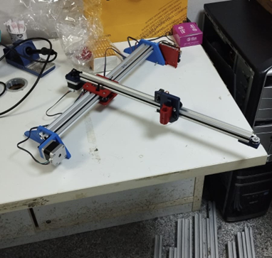
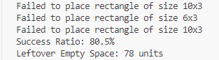
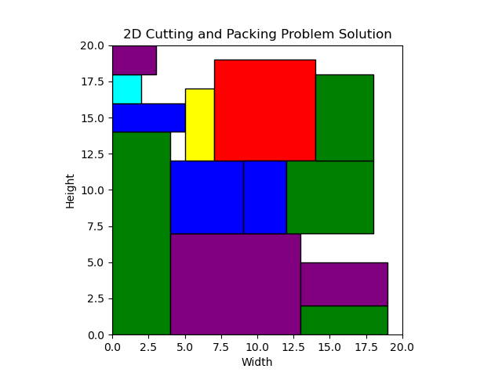
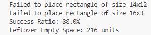
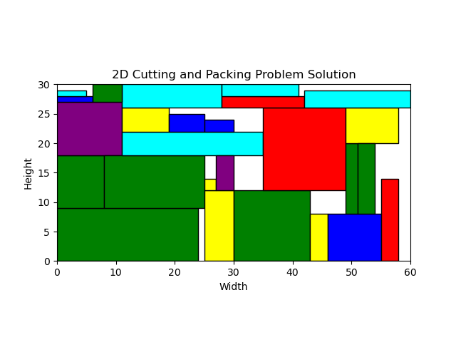

# Rectangular Object Placement Optimization Project

## Overview

This project is dedicated to the optimal placement of rectangular objects in a two-dimensional space. The primary objective is to minimize waste and costs by strategically positioning stock materials within the designated area, aiming to reduce empty spaces effectively.

## Algorithm : Left-Bottom Placement

The core algorithm utilized for optimization in this project is the Left Bottom algorithm. This algorithm plays a crucial role in achieving efficient placement, ensuring minimal unused space and enhanced utilization of resources.

In addition to the algorithm study, g code was created.

## Dataset 
The dataset contains rectangles of different numbers and sizes.
https://drive.google.com/file/d/1UkivSEXZIRQYOI2DCDZVRqVewSGavUlT/view?usp=sharing

## System Components

- **X-Y Plotter Implementation:** The system employs an x-y plotter to control the movements and placements of rectangular objects.

- **Integration with CNC Control Systems:** The project seamlessly integrates with CNC control systems through G-code, providing precision control over the placement process.

- **Arduino-Based Software:** The entire system is managed by Arduino-based software, offering a reliable and customizable platform for control and coordination.

## Usage Instructions

1. **Arduino Software Loading:**
   - Load the provided Arduino software onto the device.
   - Use the Arduino IDE for controlling the system, coordinating motor movements, and managing the pen mechanism.

2. **Software Installation and Calibration:**
   - Follow the installation process to set up the software.
   - Conduct system tests during the installation to ensure proper functioning.
   - Perform calibration procedures for each axis of movement.

3. **G-code Conversion and Transfer:**
   - In the final stage, the generated code is transformed into G-code format.
   - Utilize Inkscape software for the conversion process.
   - Transfer the converted G-code to the CNC control system.

4. **Mechanical Device Control:**
   - The Universal Gcode Sender (UGS) is employed for the mechanical device to read and interpret the G-code.
     
## X - Y Plotter

## Results

### C1_3 Dataset

### C2_3 Dataset

## C1_1 Result with Plotter

## Conclusion

This project combines hardware and software components to achieve optimal rectangular object placement using the Down-Left algorithm. The integration with CNC control systems and Arduino-based management ensures precision and efficiency throughout the process.

